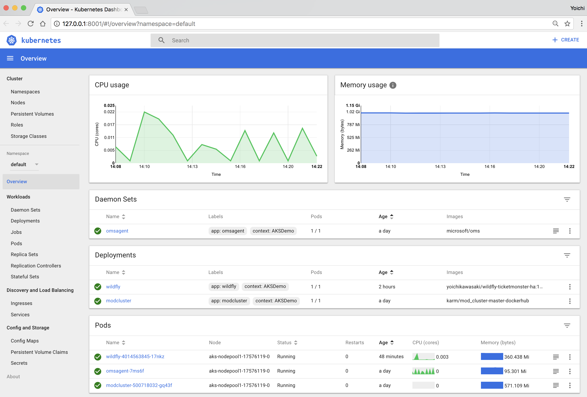

#  AKS Cluster Operations

## Scale AKS Cluster

If you want to scale your AKS cluster named myAKSCluster in the resource group named RG-aks from 1 to 2 nodes, run the following command:
```
az aks scale --name myAKSCluster --resource-group RG-aks --node-count 2
```

Check the list of nodes with the kubectl:
```
$ kubectl get nodes

(SAMPLE OUTPUT)
NAME                       STATUS    ROLES     AGE       VERSION
aks-nodepool1-17576119-0   Ready     agent     2h        v1.7.7
aks-nodepool1-17576119-1   Ready     agent     1m        v1.7.7
```

See also [Scale an Azure Container Service (AKS) cluster](https://docs.microsoft.com/en-us/azure/aks/scale-cluster) to lean more about the configuration

## Upgrde AKS Cluster

Check which Kubernetes releases are available for upgrade for your AKS cluster named myAKSCluster in resource group named RG-aks:
```
az aks get-versions --name myAKSCluster --resource-group RG-aks --output table

(SAMPLE OUTPUT)
Name     ResourceGroup    MasterVersion    MasterUpgrades       NodePoolVersion    NodePoolUpgrades
-------  ---------------  ---------------  -------------------  -----------------  -------------------
default  RG-aks           1.7.7            1.8.2, 1.8.1, 1.7.9  1.7.7              1.8.2, 1.8.1, 1.7.9
```

Run the following command to upgrade your cluster to kubernetes version '1.8.2':

```
az aks upgrade --name myAKSCluster --resource-group RG-aks --kubernetes-version 1.8.2
```

See also [Upgrade an Azure Container Service (AKS) cluster](https://docs.microsoft.com/en-us/azure/aks/upgrade-cluster) to lean more about the configuration


## Browse Kubernete dashboard with AKS

If you want to browse Kubernete dashbboard for your AKS cluster named myAKSCluster in the resource group named RG-aks, run the following command:
```
az aks browse --resource-group RG-aks --name myAKSCluster
```
See also [Kubernetes dashboard with Azure Container Service (AKS)](https://docs.microsoft.com/en-us/azure/aks/kubernetes-dashboard) to learn more about this command.

